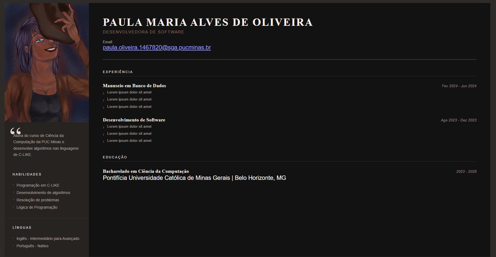
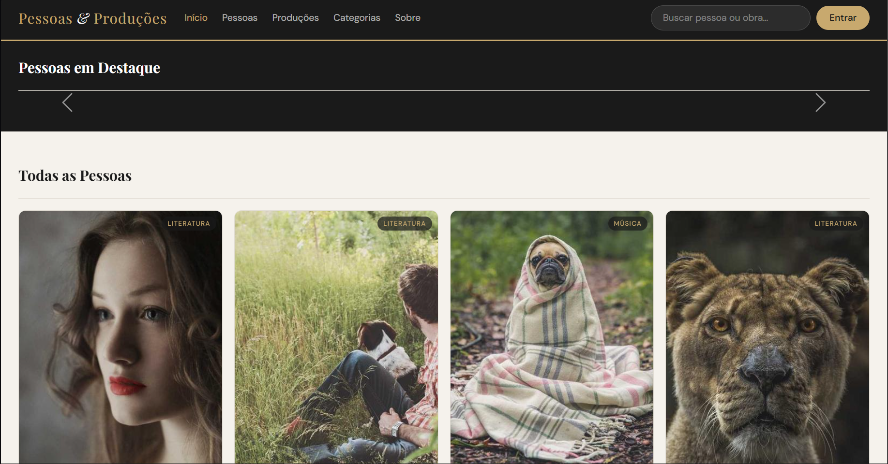
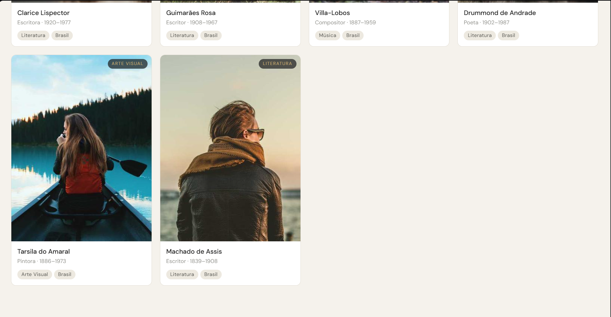
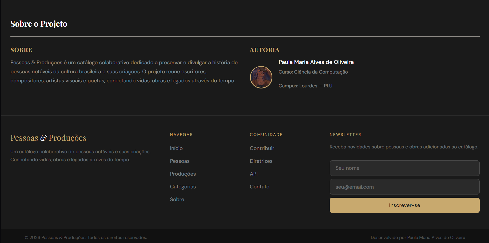
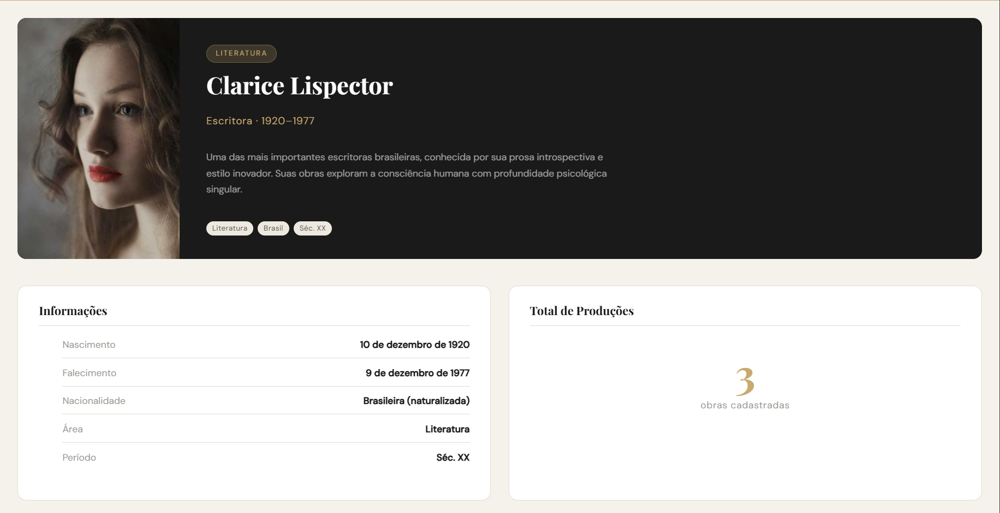
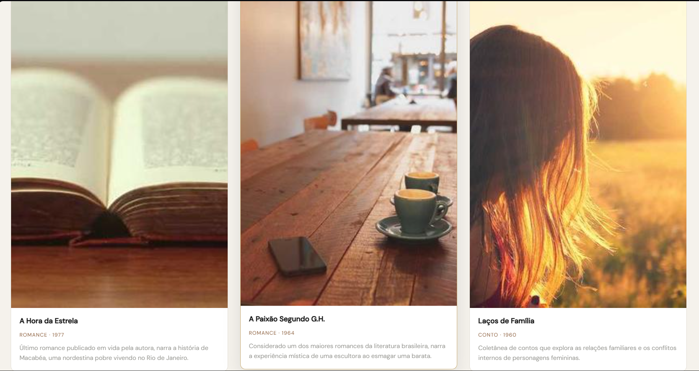
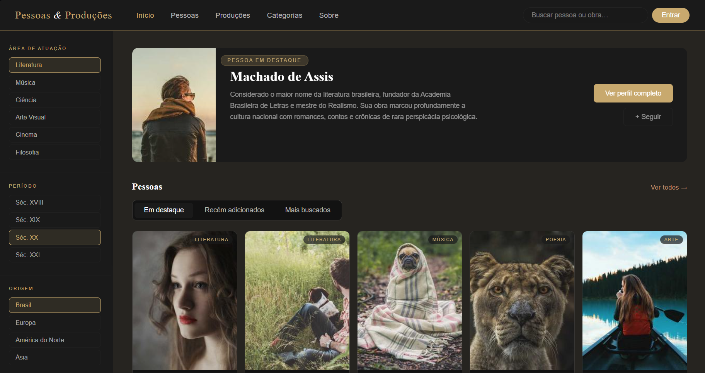
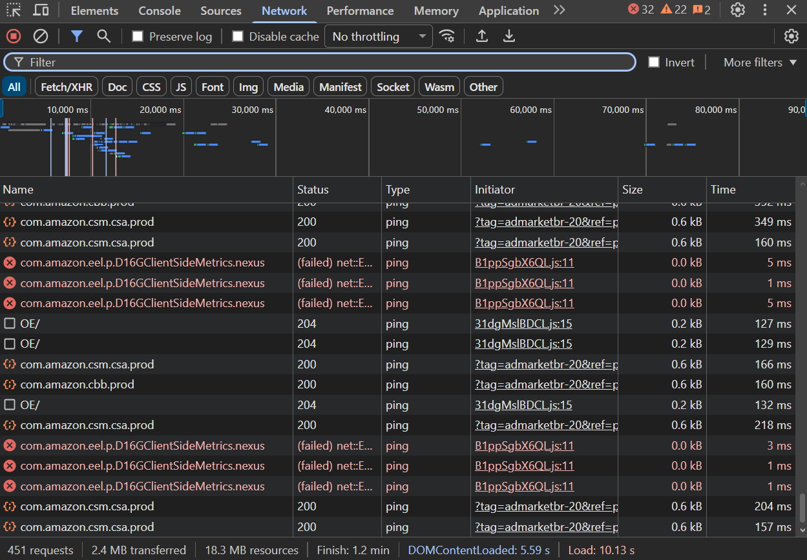

# DIW
(Está tudo no modo "dark mode" devido as configurações do meu navegador)
- Nome completo: Paula Maria Alves de Oliveira
- Matrícula: 818126
- Campus: Lourdes - PLU

---

- Visualização da página HTML (atividade - currículo):



---

## Visualização da página HTML (atividade - home page):

- Proposta escolhida: Pessoas & Produções
- Proposta do projeto: exemplificar uma página onde o foco são autores famosos da literatura brasileira

---

## Sobre o projeto

Pessoas & Produções é um catálogo dinâmico que apresenta informações sobre pessoas notáveis da cultura brasileira (escritores, compositores, pintores e poetas) e suas obras associadas.
 
O site é composto por duas telas:
 
- **Home (`index.html`)** — exibe um carousel com as pessoas em destaque e um grid com todas as pessoas cadastradas. Ao clicar em uma pessoa, o usuário é direcionado para a página de detalhes.
- **Detalhes (`detalhes.html`)** — exibe informações completas sobre a pessoa selecionada (nome, profissão, período, bio, nascimento, nacionalidade, área e século) e um grid com todas as produções associadas a ela.
Todos os dados são carregados dinamicamente via requisições **Fetch** para a API do **JSON Server**.

---

## Prints das telas: 





### Exemplo de uma das grids de pessoas (página de detalhes)




---

## Tecnologias utilizadas

### CSS Puro
- HTML5 semântico (`header`, `nav`, `aside`, `main`, `section`, `article`, `footer`)
- CSS Grid para layout de 2 colunas (sidebar + conteúdo)
- Flexbox para navbar, cards e seção de relações
- Media Queries para breakpoints:
  - `max-width: 1024px` → tablet: sidebar oculta, grids de 3 colunas
  - `max-width: 640px` → mobile: 1–2 colunas, navbar compacta, hero em coluna única

### Bootstrap 5
- Bootstrap 5.3 via CDN
- Grid system com `row-cols-2 row-cols-md-3 row-cols-lg-5`
- Navbar responsiva com `navbar-expand-lg` e toggler
- Sidebar oculta em mobile com `d-none d-lg-block`
- Utilitários: `d-flex`, `gap-*`, `ms-auto`, `flex-wrap`, `d-none d-md-inline`





## Estrutura JSON

O site utiliza 'db/db.json' contendo duas entidades:

### 'pessoas' como entidade principal:

```json
{
  "id": 1,
  "nome": "Clarice Lispector",
  "profissao": "Escritora",
  "periodo": "1920–1977",
  "area": "Literatura",
  "origem": "Brasil",
  "seculo": "Séc. XX",
  "destaque": true,
  "imagem": "https://picsum.photos/id/1027/400/500",
  "bio": "...",
  "nacionalidade": "Brasileira (naturalizada)",
  "nascimento": "10 de dezembro de 1920",
  "falecimento": "9 de dezembro de 1977"
}
```

### 'producoes' como entidade secundária (obras):

```json
{
  "id": 1,
  "pessoaId": 1,
  "titulo": "A Hora da Estrela",
  "tipo": "Romance",
  "ano": 1977,
  "descricao": "...",
  "imagem": "https://picsum.photos/id/24/300/400"
}
```

> Cada produção é vinculada a uma pessoa pelo campo `pessoaId`.

## Endpoints da API (JSON Server)

| Método | Endpoint | Descrição |
|--------|----------|-----------|
| GET | `/pessoas` | Lista todas as pessoas |
| GET | `/pessoas?destaque=true` | Lista apenas os destaques |
| GET | `/pessoas/:id` | Busca uma pessoa pelo id |
| GET | `/producoes?pessoaId=:id` | Lista produções de uma pessoa |

---

## Estrutura dos Arquivos

```
atv_homePage/
|---db/
  |--- db.json JSON server. Dados da API
|---public/
  |--- index.html //Página principal 
  |--- index-bootstrap.html //Bootstrap
  |--- detalhes.html //Tela de detalhes do item
  |--- assets/
    |--- css/
      |--- style.css //Estilo geral do site
      |--- styleDeta.css //Estilo da página de detalhes
    |--- images/
      |--- SV OC.jpg //avatar para me representar
    |--- js/
      |--- app.js //Lógica JavaScript + Fetch
```
---

## Como Rodar:

### 1. Instalar o JSON Server

```bash
npm install -g json-server
```

### 2. Iniciar o servidor

Na raiz do projeto (`atv_homePage/`):

```bash
json-server --watch db/db.json --port 3000
```

### 3. Abrir o site

Abra o arquivo `public/index.html` no navegador ou use a extensão **Live Server** do VS Code.

> ⚠️ O JSON Server precisa estar rodando para os dados aparecerem.

---
